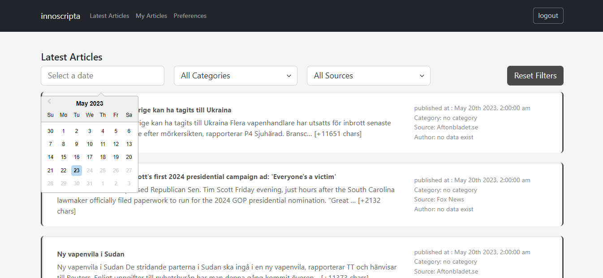

## innoscripta Task  (Coding Challenge)

## Screenshot:

### Technologies used in Backend
- **[PHP](https://php.net/)**
- **[Laravel](https://laravel.com/)**
- **[Docker](https://docker.com/)**
- **[Nginx](https://www.nginx.com/)**

### Technologies used in Frontend
- **[ReactJs](https://reactjs.org/)**
- **[Redux](https://redux.js.org/)**
- **[Redux-toolkit](https://redux-toolkit.js.org/)**
- **[Typescript](https://www.typescriptlang.org/)**
- **[redux-persist](https://www.npmjs.com/package/redux-persist)**
  
  
# How to run backend
clone 
https://github.com/ashraf-alsamman/innoscripta-backend

- run docker
 `docker-compose build `
 `docker-compose up`
  
# Run composer install and migrations and fetch new data

`composer install`

`docker exec -it app bash`

`php artisan key:generate` 
`php artisan migrate:fresh`
`php artisan new:fetch`
# How to run frontend
  clone 
  https://github.com/ashraf-alsamman/innoscripta-frontend

- Run frontend (react js) project
 `npm install`
 `npm start`
  
- Run frontend (react js) project with docker 
 ` docker build -t my-react-app docker-compose up`

 

 

 
